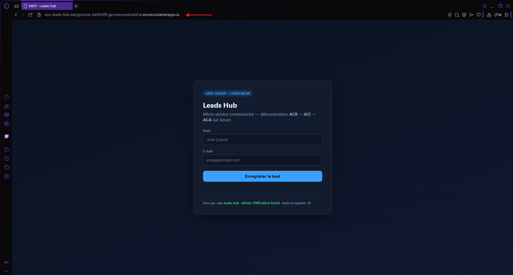
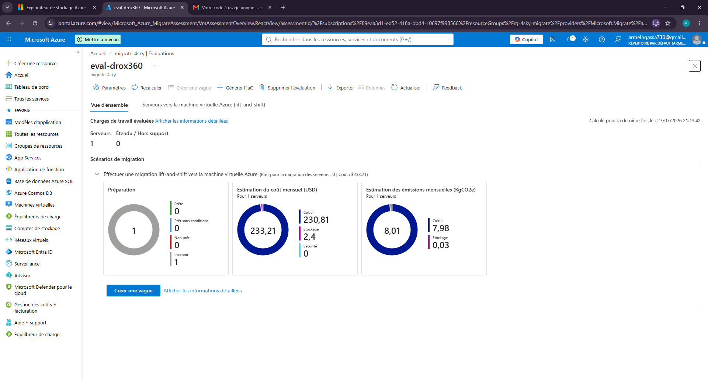
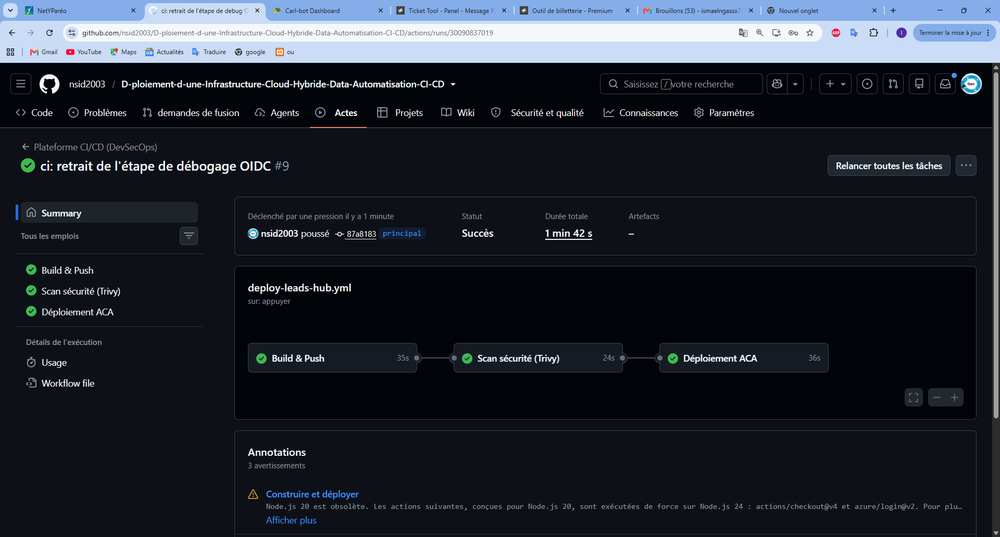

# 📝 Bloc prêt à coller — Section projet GitHub

---

## 1️⃣ Description courte (champ « About » du dépôt · ~350 caractères max)

> Infrastructure **cloud hybride** de bout en bout (On-Premise ↔ Azure) construite pour l'AZ-104 : AD DS, réseau Hub-Spoke, identité hybride, compute PaaS/IaaS/conteneurs, migration Azure Migrate, CI/CD DevSecOps (OIDC + Trivy). Présentée comme un **tutoriel pas-à-pas reproductible**.

**Topics / tags à ajouter :** `azure` · `az-104` · `hybrid-cloud` · `active-directory` · `hub-spoke` · `azure-migrate` · `devsecops` · `github-actions` · `oidc` · `terraform-alternative-bicep` · `nginx` · `hyper-v`

---

## 2️⃣ Description longue (section portfolio / profil)

### ☁️ Déploiement d'une Infrastructure Cloud Hybride, Data & Automatisation CI/CD

Projet de référence construit **de A à Z** pour préparer la certification **Microsoft Azure Administrator (AZ-104)**, enrichi des notions **AZ-700 / AZ-500 / AZ-800-801 / AZ-400**.

Il simule l'infrastructure d'une PME fictive, **4SKY Group**, qui adopte une architecture **cloud hybride** tout en conservant un datacenter local. Chaque décision technique (région, topologie, protocole, tier, service) est **justifiée**, et chaque manipulation est **illustrée dans l'ordre** — pour qu'un débutant puisse **refaire l'ensemble**.

**Ce que le projet couvre :**

- 🏢 **Datacenter On-Premise** — Windows Server (AD DS, DNS, DHCP), annuaire structuré (OU, groupes, utilisateurs)
- 🌐 **Réseau Azure gouverné** — topologie **Hub-Spoke**, VNet peering, NSG par subnet, **Azure Policy** (région + tags imposés)
- 🔗 **Hybridation** — **Azure File Sync** (fichiers) et **Entra Connect Cloud Sync** (identité hybride, PHS)
- 🖥️ **Compute complet** — **Static Web Apps** (PaaS), **VM Ubuntu + Nginx** (IaaS), **ACR → ACI → ACA** (conteneurs)
- 🚚 **Migration** — découverte + évaluation avec **Azure Migrate** (appliance Hyper-V, readiness, coût)
- 🔐 **CI/CD DevSecOps** — **GitHub Actions** en 3 jobs, authentification **OIDC** (zéro secret), scan **Trivy** *shift-left*
- 🛡️ **Supervision & SIEM** — Log Analytics, Azure Monitor, **Microsoft Sentinel** + KQL
- 💾 **Sauvegarde** — Recovery Services Vault (Azure Files Backup)

**Points forts :**

- 📸 **Tutoriel reproductible** : ~100 captures agencées dans l'ordre exact des actions, chacune expliquée et justifiée.
- 🛠️ **Vrais problèmes, vraies solutions** : un **journal de troubleshooting** documente 18 incidents réels (MFA, DNS, OIDC personnalisé, régions bloquées, WinRM, Hyper-V client…).
- 💰 **Discipline budget** : ressources coûteuses déployées → testées → **supprimées** pour préserver le crédit.
- 🧩 **Vrais sites de production** déployés sans jamais modifier leurs dépôts (copie du build uniquement).

**Stack :** Microsoft Azure · Microsoft Entra ID · Windows Server · VMware / Hyper-V · Azure CLI · **Bicep** · Docker · Node.js · GitHub Actions · Trivy · Sentinel (KQL) · Nginx

---

## 3️⃣ Galerie de captures sélectionnées (avec légendes)

> À coller dans le README ou la page projet. Les chemins pointent vers le dossier `Screenshots/`.

### 🏗️ Architecture cible (vue globale hybride)

*Topologie Hub-Spoke hybride : datacenter On-Premise relié à Azure, segmentation réseau, sécurité et identité.*

### 🔐 Chaîne DevSecOps

*Pipeline CI/CD sécurisé : build → scan → déploiement, avec les outils DevSecOps intégrés.*

### 🧭 Datacenter On-Premise (AD DS · DNS · DHCP)

*Contrôleur de domaine `4skygroup.local` opérationnel : AD DS, DNS et DHCP autorisé dans l'annuaire.*

### 🌐 Réseau Azure Hub-Spoke

*VNets Hub et Spoke appairés (« Connecté » des deux côtés), gouvernés par Azure Policy.*

### 🔗 Identité hybride (Entra Connect Cloud Sync)

*Utilisateurs de l'AD local synchronisés vers Microsoft Entra ID (UPN routable, PHS).*

### 🐳 Conteneurs — Azure Container Apps

*Micro-service `leads-hub` déployé sur ACA : ingress HTTPS automatique, autoscale, scale-to-zero.*

### 🚚 Migration — évaluation Azure Migrate

*Découverte et évaluation d'une charge de travail Hyper-V : readiness Azure, dimensionnement et coût mensuel estimé.*

### 🔐 CI/CD DevSecOps — pipeline vert

*Pipeline 3 jobs (Build → Scan Trivy → Déploiement ACA) en authentification OIDC, sans aucun secret stocké.*

---

## 4️⃣ Badges (optionnel, en haut du README)

```markdown


```
